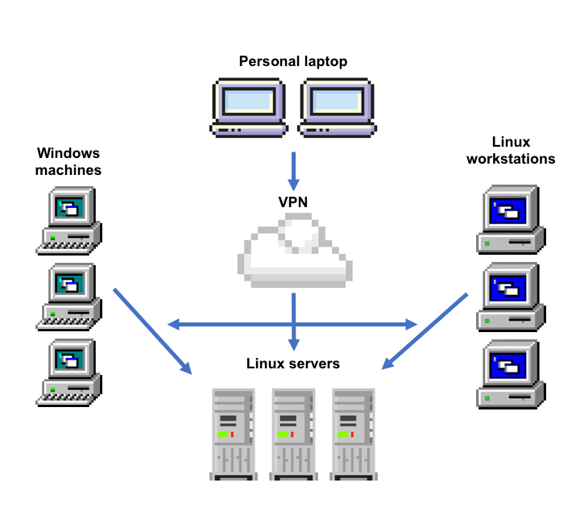
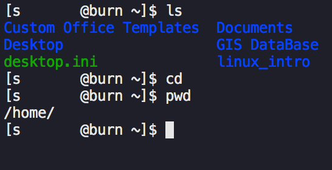
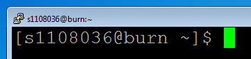
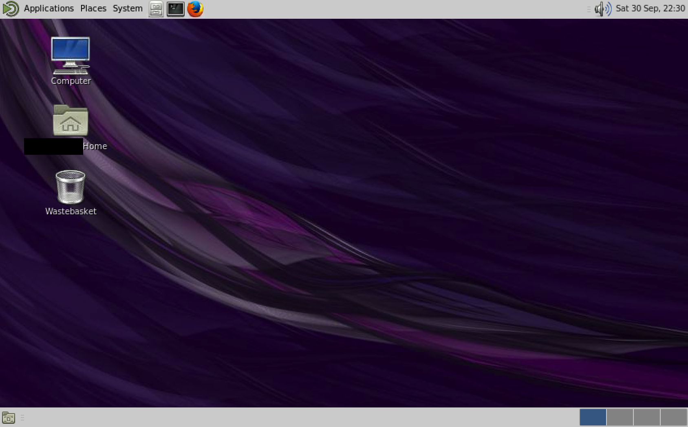

# Table of Contents:

1. [Introduction](#introduction)
2. [What is UNIX?](#what)
3. [The GeoSciences networ structure](#network)
4. [Logging in](#login)
5. [Basic commands](#basic)
6. [Scratch space](#scratch)
7. [Text editors](#editors)
8. [Monitoring processes](#monitor)
9. [Shell scripting](#scripting)
10. [(n)curses programs](#curses)

<a name="introduction"></a>
# Linux in GeoSciences

The purpose of this workshop is to familiarise yourself with the UNIX based computing systems in the School of GeoSciences.

Students use the GeoSciences UNIX systems for a variety of tasks, including but not limited to:

- Simulation modelling
- GIS and mapping
- Running an email server
- Statistical programming

Unlike the Windows operating system, UNIX based operating systems give much more control to the user. The most common and powerful method of interaction with a UNIX based system is through the command line rather than through a windows-like point and click interface. Additionally, much of the software available on UNIX platforms is free and open source, meaning that everybody has access to the code used to create a piece of software, meaning that you know exactly what the program is doing. Having this amount of control and knowledge is a very useful attribute in academia where research should be entirely [reproducible and repeatable](LINK).

While this workshop is not designed to be a definitive reference, it should provide a good introduction from which you can continue to learn about this powerful resource.

All the introduction materials, including this sheet, can be found at:

```
http://www.geos.ed.ac.uk/~gisteac/wkzero
```

## Targets for this session

By the end of this workshop you should be able to:

- Log on to any UNIX machine in the School of GeoSciences
- Locate your home directory
- View a file list using `ls`
- Change directories using `cd`
- Create directories using `mkdir`
- Copy, move, rename and delete files and directories using `cp`, `mv`, `rm`
- View plain text files in a number of different ways
- Find help on commands/programs using `man` and help on the web
- Download and retrieve data via FTP
- Monitor memory usage, and find out about other users on the system using `finger`, `ps`, `kill`
- Search within files using `grep`
- Start full UNIX applications and understand about different types of application
- Connect to different machines using `ssh`
- Tell other people how awesome UNIX is


## What is UNIX?

UNIX is a loose family of operating systems that share characteristics and are derived from the original AT&T UNIX OS that was developed by Bell Labs in the 1970s. Many UNIX-like operating systems have arisen since then, most notably, Linux, Android, and macOS.

The Operating System that most of the GeoSciences UNIX systems run on is called Linux.

## GeoSciences network structure

There are three main ways to access systems running Linux in the School of GeoSciences:

- Login directly to a GeoSciences Linux workstation, which access Linux servers by default
- Login to a GeoSciences Windows machine and connect to a Linux server remotely
- Login to a Linux server remotely from your personal computer, when connected to the University VPN

By far the most common way to access Linux is to use a GeoSciences Windows machine and connect to a Linux server remotely, though using a personal laptop is becoming more popular.



## Logging in to the GeoSciences Linux servers via the command line

Most of the tasks you will need to use a Linux server for can be achieved through a command line interface like the one in the picture below:



Choose your method of connecting to the GeoSciences Linux server from the options below and follow the instructions in that section.

#### Logging in from a GeoSciences Windows machine
To connect from a Windows machine to the GeoSciences Linux server you can use PuTTY. PuTTY is a free and open source program that provides a terminal interface to allow connecting to other machines. The PuTTY application is located at: `U:\SCE\GEOS\putty.exe`. I recommend making a shortcut to it and putting it on your desktop.

First, open PuTTY and configure the PuTTY session. `burn` is the name of the GeoSciences Linux server, it's address is `burn.geos.ed.ac.uk`:

"Host Name (or IP address)" = `burn.geos.ed.ac.uk`
"Port" = `22`
"Connection type:" = `SSH`
In "Category: Connection, SSH" Check `Enable X11 forwarding` - which allows X window applications to be opened on your desktop (e.g. `xeyes`)

Then click "Open" to start the connection, type your UUN (e.g. `s1234567`) and the password you use to login to MyEd, Windows machines etc.

#### From a personal Windows machine
You can also use PuTTY on your own windows machine, you can download it from [here](https://www.chiark.greenend.org.uk/~sgtatham/putty/latest.html).

Make sure you are connected to the University VPN service ([more information can be found here](http://www.ed.ac.uk/information-services/computing/desktop-personal/vpn)), then open PuTTY and connect using the same options as for a GeoSciences Windows machine.

#### From a personal macOS/Linux machine
If you have a personal macOS or Linux machine you can use a terminal emulator such as `Terminal.app` to connect to a University Linux server.

Open `Terminal.app` or your terminal emulator of choice and type the following, replacing `s1234567` with your own UUN:

```
ssh -X s1234567@burn.geos.ed.ac.uk
```

Press "Enter", then follow the instructions. When it asks for your password use the one you use to login to MyEd, don't worry if the password doesn't look like it's being typed, the computer is just trying to keep your details secret!

## The Linux folder structure
By this point you should be connected to the Linux burn server using whatever means suits you, if not, go back and try again, using one of the options above. When you first login your terminal window should look like this:



```
[s1234567@burn ~]$ ■
```

This innocuous line, known as the bash prompt actually tells us some useful information:

- `s1234567` is obviously your UUN
- `burn` is the hostname, i.e. the name of the server you are connected to
- `~` Is the directory you are currently in, `~` is shorthand for the home directory
- `$` marks the end of the bash prompt and the start of the space where you can type commands

## Basic file system operations from the command line

### Changing directories

To see what directories and files are inside the current directory type:

```
ls
```

followed by the <Enter> key. All commands must be followed by the <Enter> key to run them.

To change to another directory, type `cd` then the directory name. List the directories in your current directory using `ls` then pick one and change to it:

```
ls

cd Documents
```

Notice that the `~` in the prompt has been replaced with `Documents`, telling us we are now in the `Documents` directory. Enter `ls` again to see that the list of files has also changed, because you are in a different directory.

The `~` (tilde character) is shorthand for the `home` directory. When you log into a Linux system you will automatically be taken to the `home` directory. The `home` directory is analogous to the `M:` drive on a Windows machine. It is a space where you can store personal files that only you can access. The `home` directory default size is quite small, but can be increased if you need extra space for your research. As an added bonus the `~`/`home`/`M:` directory is backed up every night, so there is hardly any chance of losing your data when it is stored in this directory.

To move up one directory e.g. from `Documents` back to the home directory, type:

```
cd ..
```

The `..` two dots are shorthand for the directory directly above the one you are in.

To jump back to the `home` directory from anywhere, just type `cd` without specifying any directory:

```
cd
```

Try this out by `cd`ing into a directory of your choice, then jumping back to the `home` directory using `cd`.

### Creating directories and files

To demonstrate some of the simple file operations that you can perform from the command line, return to the home folder (`cd`) and make a new directory called `linux_intro` like this:

```
mkdir linux_intro
```

`cd` into that directory and create three more directories, `notes`, `downloads` and `data`:

```
cd linux_intro

mkdir notes

mkdir downloads

mkdir data
```

Then create a directory inside the notes directory called `wk_1`:

```
mkdir notes/wk_1
```

Notice that I used `/` to create the `wk_1` directory inside an existing directory.

Type `tree` to check that all the directories have been created. `tree` gives a nice overview of the directory structure in the directory you are currently in.

`cd` into the `notes` directory, then the `wk_1` directory and create an empty file called `notes.txt` like this:

```
cd ~/linux_intro/notes/wk_1

touch notes.txt
```

Notice how instead of using the relative filepath to move into the `wk_1` directory (e.g. `cd wk_1`), this time I used the full filepath (`~/linux_intro/notes/wk_1`) because I was too far away from the `wk_1` directory for Linux to know what I was talking about.

Move back to the `linux_intro` folder and check out the new directory structure you have made by typing:

```
cd ../..

tree
```

The output should look like this:


### Moving files and directories

Next I want to make a copy of my `notes.txt` file and place it in my `home` directory. To do this I can use `cp`:

```
cp ~/linux_intro/notes/wk_1/notes.txt ~/notes.txt
```

But it would be much more useful if the file was in my `Documents` directory, so I can move the file using `mv`:

```
cd

mv notes.txt ~/Documents/notes.txt
```

`mv` can also be used to rename files:

```
cd ~/Documents

mv notes.txt linux_notes.txt
```

We have done a lot of moving around different directories, which can become confusing. If you ever want to check what directory you are in you can type:

```
pwd
```

Imagine I'm done working with `~/Documents/linux_notes.txt` and want to delete it. I can delete files using:

```
rm ~/Documents/notes.txt
```

But it is important to note that when you delete a file in this way it doesn't get moved to the recycling bin, IT IS GONE FOREVER!

I can also remove directories by adding the `-r` flag to `rm`:

```
cd ~/linux_intro

rm -r data
```

Flags can be added to many commands to change their behaviour, or to tell the command that you are about to add information of a certain type. Another command you can add to `rm` is the `-i` flag, which asks the user whether they really want to delete the file before deleting it, which is very useful when `rm` deletes files irreversibly. I could delete `~/Documents/linux_notes.txt` using the `-i` flag:

```
rm -i ~/Documents/linux_notes.txt
```

To find out about other flags and their uses you can use the `man` command followed by the command you want to investigate. This opens the `man`ual page for that command. While `man` pages can be a bit dense, they should be your first port of call when investigating what a command does. e.g.:

```
man rm
```

The `man` page will be opened in what is known as a "pager". Pagers allow you to preview plain text documents by scrolling up and down, but don't let you edit the document. They are a good way of quickly getting an idea of what is in a document.

There are multiple pagers that you can specify but the one that `man` uses by default is called `less`.

### Shared resources
As well as your personal data stored in the `home` directory, you can access shared data in the `/geos` folder. This might be the data for a specific course like the Kindrogan field course, or open access data such as shapefiles for Scotland's roads.

Move to the `/geos` directory like this:

```
cd /geos
```

It is important to note that while you can open files in the shared space, it is unlikely that you will be able to edit them. Instead you can copy them to your `home` folder using `cp` to have an editable copy.

Try this by copying the contents of the `/geos/netdata/wkzero` directory to your home folder

```
cd ~/geos/netdata

cp -r wkzero/ ~/
```

Notice how I had to add the `-r` flag to let `cp` know that I wanted to copy a directory instead of a file. Also note the `/` I used to specify that `wkzero` is a directory, not a file.

### Scratch space
Another shared space that will be useful is `/scratch/s1234567`, obviously your scratch space will be named after your UUN. Scratch space offers a very large amount of temporary storage space. It is not backed up so don't leave anything important on there for too long, but it could be useful if you want somewhere to unpack a huge dataset, or create lots of model objects.

To move to your scratch space just type:

```
cd /scratch/s1234567
```

switching out `s1234567` with your own UUN.

## Text editors
Our notes file (`~/linux_intro/notes/notes.txt`) is still a blank file. Let's fill it with some notes. There are a multitude of terminal based text editors available on the GeoSciences Linux systems. Some notable ones, in my own order from most to least complex are:

- `emacs`
- `vim`
- `ed`
- `nano`

Open up our blank `notes.txt` file using `nano` (use the code below to help), type some text then save and exit using `Ctrl-x`.

```
cd ~/linux_intro/notes

nano notes.txt
```

Then use the `less` pager to read the text you just typed:

```
less notes.txt
```

Tip: type `q` to exit `less`

## Piping and redirecting data

Move back to the home directory then `cd` to the `wkzero` directory we copied earlier:

```
cd

cd wkzero
```

Check what files are in the directory with `ls` then quickly see what is in `jabberwock.txt` using `less`

```
ls

less jabberwock.txt
```

We can redirect the contents of one file into another using the `>` operator. `>` takes what ever is on the left hand side and puts it into the file on the right hand side. We can add the contents of `jabberwock.txt` to `~/linux_intro.txt` like this:

```
cat jabberwock.txt > ~/linux_intro/notes.txt
```

`cat` merely prints the contents of the file it is given, in this case `jabberwock.txt`. After you have done the above, check that `notes.txt` contains the new information using cat:

```
cd ~/linux_intro

cat notes.txt
```

A similar operator is the `|`, also known as a pipe. `|` takes whatever is on the left and uses it in the next command. We will investigate how pipes work using a new command called `grep`.

First `cd` to the `wkzero` directory:

```
cd ~/wkzero
```

Use `cat` on the `nation_data.txt` file to see that it contains a lot of data:

```
cat nation_data.txt
```

But I want to find only the lines that are about the country of Canada. I can use `grep` to filter out just those lines, then present that data in a pager like `less` like this:

```
cat nation_data.txt | grep Canada | less
```

Just to recap, I took the contents of `nation_data.txt` (`cat nation_data.txt`), then fed that to the grep command to look only for lines containing the word `Canada` (`grep Canada`), then fed all that to `less`, my pager of choice (`less`). It's easy to see how this could become a useful tool for quickly sifting through data to look for the interesting bits.

`grep` can take many different types of arguments, I recommend reading the `man` page for `grep` or look at some online tutorials to see what it can really do.


## Monitoring processes

On the GeoSciences Linux servers, you can see what everybody else is doing, and everybody else can see what you are doing. It is useful to know what processes you have running so that you can terminate processes, or manage your memory usage.


## Running background processes

Sometimes a process will continue running indefinitely until you stop it. This is especially true if you start a GUI program from the command line, e.g. a web browser.

To make sure that you can continue using the terminal while this process is happening you can use the `&` operator. For example, if I run `xeyes`, but want to keep using the terminal while this program is open I can type:

```
xeyes &
```

This will give the process ID number and then let me continue to use the terminal.

I can kill the program either by clicking the cross in the `xeyes` window like a normal program, or I can type:

```
kill <PID>
```

Where <PID> is the ID number that I was presented with earlier.

## Shell scripting

## Downloading files from a file server

## Printing files from the command line

## Manipulating pdf files

## (n)curses programs

### Alpine

## Logging on using a graphical interface

Some programs may require a graphical user interface (GUI). For these programs to work you will need to run a desktop on the linux servers, like the one in the picture below:



#### From a GeoSciences Windows machine

Open "NX Connection Wizard" from the Start menu.

Configure the connection like so:

"Session" = `burn.geos.ed.ac.uk`
"Host" = `burn.geos.ed.ac.uk`
"Port" = `22`
"Select type of your internet connection." = `ADSL`
"Client" = `Unix`
"Desktop environment" = `KDE` - __This can be changed__
"Select size of your remote desktop" = `Available area` - __This can be changed__

Then when the login window appears, login with your UUN and the password you use to login to MyEd.

#### From a personal Windows/macOS/Linux machine

Download NoMachine from (https://www.nomachine.com/download)[https://www.nomachine.com/download]

Connect to the University VPN ([more information can be found here](http://www.ed.ac.uk/information-services/computing/desktop-personal/vpn)).

Open NoMachine

Create a new connection:

Select Protocol: SSH

Type Host: `nx.geos.ed.ac.uk`, Port: `22`

Select "Use NoMachine login"

Make sure "Use and alternate server key" is left unchecked and blank

Select "Don't use a proxy"

Give the connection a sensible name

Connect to the newly created connection and select a desktop environment such as `KDE`.

When prompted for a password use the password you use to login to MyEd
