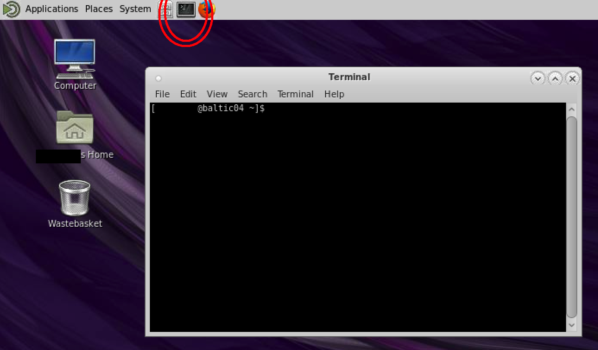
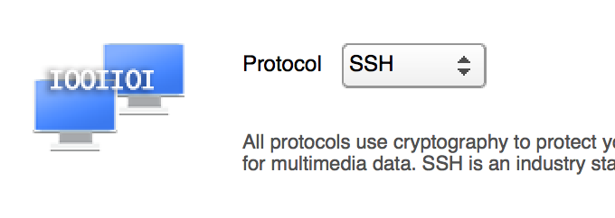
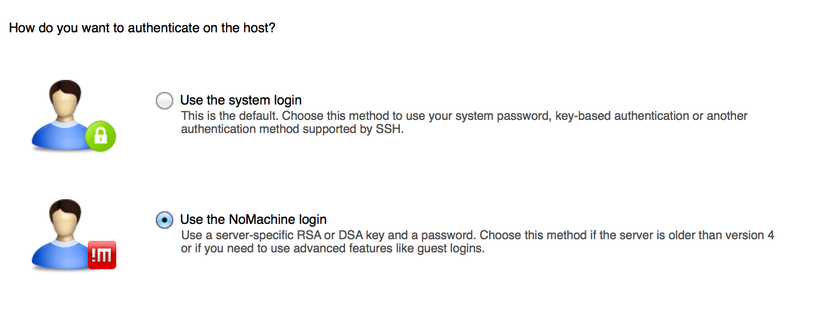
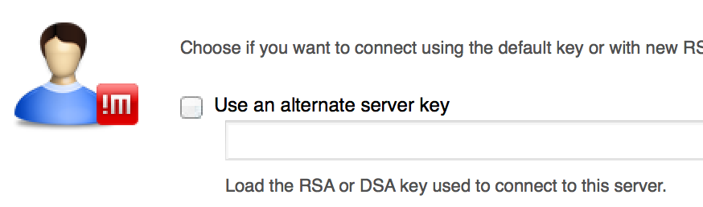
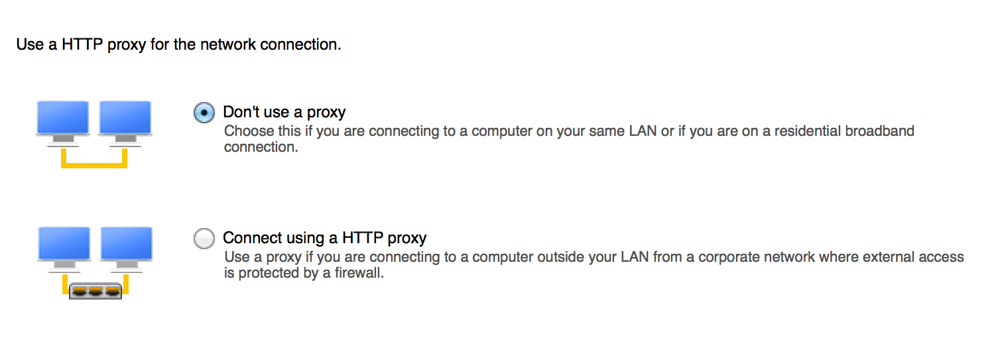
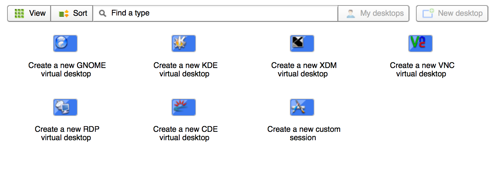
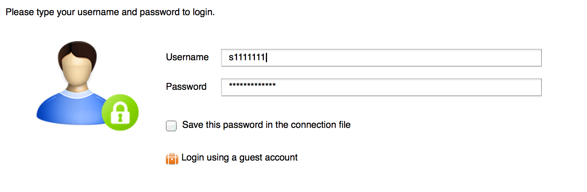

# Linux in GeoSciences

## Table of Contents:

1. [Introduction](#introduction)
2. [What is UNIX?](#what)
3. [The GeoSciences network structure](#network)
4. [Logging in via the command line](#login)
5. [The basics](#basic)
6. [Shared resources and Scratch space](#scratch)
7. [Text editors and pagers](#editors)
8. [Piping and redirecting data](#pipes)
9. [Monitoring processes](#monitor)
10. [Running background processes](#background)
11. [Shell scripting](#scripting)
12. [Downloading files](#download)
13. [Printing in Linux](#printing)
14. [Using a graphical interface](#gui)
15. [Adding network drives to a personal computer](#net_drive)
16. [Even more computing power with `eddie`](#eddie)


<a name="introduction"></a>

## Introduction

The purpose of this workshop is to familiarise yourself with the UNIX based computing systems in the School of GeoSciences.

Unlike the Windows operating system, UNIX based operating systems give much more control to the user. The most common and powerful method of interaction with a UNIX based system is through the command line rather than through a windows-like point and click interface. Additionally, much of the software available on UNIX platforms is free and open source, meaning that everybody has access to the code used to create a piece of software, meaning that you know exactly what the program is doing. Having this amount of control over your computing is very useful in academia where research should be entirely [reproducible and repeatable](http://www.bioone.org/doi/full/10.1641/0006-3568(2006)56%5B958:RARIE%5D2.0.CO%3B2). Using a text interface will also give you a lot more creative power to design analyses the way you like.

Students use the GeoSciences UNIX systems for a variety of tasks, including but not limited to:

- Simulation modelling
- GIS and mapping
- Running an email server
- Statistical programming

While this workshop is not designed to be a definitive reference, it should provide a good introduction from which you can continue to learn about this powerful resource.

All the introduction materials, including this sheet, can be found at:

```
http://www.geos.ed.ac.uk/~gisteac/wkzero
```

## Targets for this session

By the end of this workshop you should be able to:

- Log on to any UNIX machine in the School of GeoSciences
- Locate your home directory
- Perform simple file operations on the command line using, `ls`, `cd`, `mkdir`, `cp`, `mv`, `rm`
- View plain text files in a number of different ways using pagers and editors
- Find help on commands/programs using `man` pages
- Download and retrieve data via FTP
- Monitor memory usage, and find out about other users on the system using `finger`, `ps`, `kill`
- Search within files using `grep`
- Connect to the GeoSciences Linux server using a graphical client
- Map GeoSciences network drives on your personal computer
- Tell other people how awesome UNIX is

<a name="what"></a>

## What is UNIX?

UNIX is a loose family of operating systems that share characteristics and are derived from the original AT&T UNIX OS that was developed by Bell Labs in the 1970s. Many UNIX-like operating systems have arisen since then, most notably, Linux, Android, and macOS.

The Operating System that most of the GeoSciences UNIX systems run on is called Linux.

<a name="network"></a>

## GeoSciences network structure

There are three main ways to access systems running Linux in the School of GeoSciences:

- Login directly to a GeoSciences Linux workstation, which access Linux servers by default
- Login to a GeoSciences Windows machine and connect to a Linux server remotely
- Login to a Linux server remotely from your personal computer, when connected to the University VPN

By far the most common way to access Linux is to use a GeoSciences Windows machine and connect to a Linux server remotely, though using a personal computer or laptop is becoming more popular.

<center>  </center>

<a name="login"></a>

## Logging in to the GeoSciences Linux servers via the command line

Most of the tasks you will need to use a Linux server for can be achieved through a command line interface like the one in the picture below:

<center>  </center>

Choose your method of connecting to the GeoSciences Linux server from the options below and follow the instructions in that section.

### Logging in from a GeoSciences Windows machine
To connect from a Windows machine to the GeoSciences Linux server you can use PuTTY. PuTTY is a free and open source program that provides a command line interface to allow you to connect remotely to other machines. The PuTTY application is located at: `U:\SCE\GEOS\putty.exe`. I recommend making a shortcut to it and putting it on your desktop.

First, open PuTTY and configure the PuTTY session using the instructions below. `burn` is the name of the GeoSciences Linux server, it's address is `burn.geos.ed.ac.uk`:

- "Host Name (or IP address)" = `burn.geos.ed.ac.uk`
- "Port" = `22`
- "Connection type:" = `SSH`
- In "Category: Connection, SSH" Check `Enable X11 forwarding` - which allows X window applications to be opened on your desktop (e.g. `xeyes`)

Then click "Open" to start the connection, type your UUN (e.g. `s1234567`) and the password you use to login to MyEd, Windows machines etc.

### From a personal Windows machine

You can also use PuTTY from your own windows machine, you can download it from [here](https://www.chiark.greenend.org.uk/~sgtatham/putty/latest.html).

Make sure you are connected to the University VPN service ([more information can be found here](http://www.ed.ac.uk/information-services/computing/desktop-personal/vpn)), then open PuTTY and connect using the same options as the ones above for a GeoSciences Windows machine.

### From a personal macOS/Linux machine

If you have a personal macOS or Linux machine you can use a terminal emulator such as `Terminal.app` to connect to a University Linux server.

Open `Terminal.app` or your terminal emulator of choice and type the following, replacing `s1234567` with your own UUN:

```
ssh -x s1234567@burn.geos.ed.ac.uk
```

Press "Enter", then follow the instructions. When it asks for your password use the one you use to login to MyEd, don't worry if the password doesn't look like it's being typed, the computer is just trying to keep your details secret!

<a name="basic"></a>

## The basics

### The bash prompt

By this point you should be connected to the Linux `burn` server using whatever means suits you, if not, go back and try again, using one of the options above. When you first login your terminal window should look something like this:

```
[s1234567@burn ~]$ ■
```

This innocuous line, known as the bash prompt actually tells us some really useful information:

- `s1234567` is obviously your UUN.
- `burn` is the hostname, i.e. the name of the server you are connected to.
- `~` Is the directory you are currently in, `~` is shorthand for the home directory.
- `$` marks the end of the bash prompt and the start of the space where you can type commands.

### Changing directories

Before we continue, it's important to note that the word "directory" is used in the Unix literature to mean the same thing as "folder" on a Windows machine.

To see what directories and files are inside the current directory type:

```
ls
```

followed by the <Enter> key. All commands must be followed by the <Enter> key to run them. The `ls` command should output a list of the directories and files inside the `~` directory, because that is the directory we are currently in.

To change to another directory, type `cd` then the directory name. List the directories in your current directory using `ls` then pick one and change to it:

```
ls

cd Documents
```

Notice that the `~` in the prompt has been replaced with `Documents`, telling us we are now in the `Documents` directory. Enter `ls` again to see that the list of files and directories has also changed, because you are in a different directory.

The `~` (tilde character) is shorthand for the `home` directory. When you log into a Linux system you will automatically be taken to the `home` directory. The `home` directory is analogous to your `M:` drive on a Windows machine. It is a space where you can store personal files that only you can access. The `home` directory default size is quite small, but can be increased if you need extra space for your research, just [email IS services](mailto:is.helpline@ed.ac.uk). As an added bonus the `~`/`home`/`M:` directory is backed up every night, so there is hardly any chance of losing your data when it is stored in this directory.

To move up one directory e.g. from `Documents` back to the `home` directory, type:

```
cd ..
```

The `..` two dots are shorthand for the directory directly above the one you are in.

To jump back to the `home` directory from anywhere, just type `cd` without specifying any directory:

```
cd
```

Try this out by `cd`ing into a directory of your choice, then jumping back to the `home` directory using `cd`.

### Creating directories and files

Just like on a Windows machine, it will be necessary to perform various file operations during your work like moving files, making directories etc. But instead of using a drag and drop interface like on Windows, on `burn` you can use the command line. To demonstrate some of the simple file operations that you can perform from the command line, return to the home folder (`cd`) and make a new directory called `linux_intro` like this:

```
mkdir linux_intro
```

`cd` into that directory and create three more directories, `notes`, `downloads` and `data`:

```
cd linux_intro

mkdir notes

mkdir downloads

mkdir data
```

Then create a directory inside the notes directory called `wk_1`:

```
mkdir notes/wk_1
```

Notice that I used `/` to create the `wk_1` directory inside an existing directory.

Type `tree` to check that all the directories have been created. `tree` gives a nice overview of the directory structure in the directory you are currently in.

Your `tree` output should look like this:


```
.
├── data
├── downloads
└── notes
    └── wk_1
```

`cd` into the `notes` directory, then the `wk_1` directory and create an empty file called `notes.txt` like this:

```
cd ~/linux_intro/notes/wk_1

touch notes.txt
```

Notice how instead of using the relative filepath to move into the `wk_1` directory (e.g. `cd wk_1`), this time I used the full filepath (`~/linux_intro/notes/wk_1`) because `wk_1` isn't directly below my current directory so Linux wouldn't have known which directory I meant.

Move back to the `linux_intro` directory and check out the new directory structure you have made by typing:

```
cd ../..

tree
```

The output of `tree` should look something like this:


### Moving files and directories

Next I want to make a copy of my `notes.txt` file and place it in my `home` directory, so I have a copy to work on. To do this I can use `cp`. `cp` takes two arguments, the first gives the filepath of the file or directory I want to copy (`~/linux_intro/notes/wk_1/notes.txt`), and the second gives the location of where I want to put the file or directory (`~/notes.txt`):

```
cp ~/linux_intro/notes/wk_1/notes.txt ~/notes.txt
```

Actually, after some profound thoughts, I have realised that it would be much more useful if `notes.txt` was in my `Documents` directory, so I can move the file using `mv`:

```
cd

mv notes.txt ~/Documents/notes.txt
```

Because `notes.txt` isn't a particularly informative filename, I can also use `mv` to rename files:

```
cd ~/Documents

mv notes.txt linux_notes.txt
```

We have done a lot of moving around different directories, which can become confusing. If you ever want to check what directory you are in you can type `pwd`:

```
pwd
```

Imagine that I'm done working with `~/Documents/linux_notes.txt` and want to delete it. I can delete files using `rm`:

```
rm ~/Documents/notes.txt
```

But it is important to note that when you delete a file in this way it doesn't get moved to the recycling bin, __IT IS GONE FOREVER!__

I can remove a directory instead of a file by adding the `-r` flag to `rm`. In this case I want to remove the `data` directory:

```
cd ~/linux_intro

rm -r data
```

Flags can be added to many commands to change their behaviour or add special inputs. A useful flag for the `rm` command is `-i`, which asks the user whether they really want to delete the file before deleting it. Once again, the reason this is useful is because __`rm` deletes files irreversibly!__ I could delete `~/Documents/linux_notes.txt` using the `-i` flag:

```
rm -i ~/Documents/linux_notes.txt
```

To find out about other flags and their uses you can use the `man` command followed by the command you want to investigate. This opens the `man`ual page for that command. While `man` pages can be a bit dense, they should be your first port of call when investigating what a command does. e.g.:

```
man rm
```

It's also worth remembering that a quick internet search for a command followed by the word "Linux" or a brief description of your problem will almost definitely yield useful results.

### Shared resources

As well as your personal data stored in the `home` directory, you can access shared data in the `/geos` directory. This might be the data for a specific course like the Kindrogan field course, or open access data such as shapefiles for Scotland's roads.

Move to the `/geos` directory like this:

```
cd /geos
```

It is important to note that while you can open files in the shared space, it is unlikely that you will have permission to edit them. Instead you can copy them to your `home` directory using `cp` to have an editable copy.

Try this by copying the contents of the `/geos/netdata/wkzero` directory to the `~/linux_intro/downloads` directory:

```
cd /geos/netdata

cp -r wkzero/ ~/linux_intro/downloads
```

Notice how I had to add the `-r` flag to let `cp` know that I wanted to copy a directory instead of a file. Also note the `/` I used to specify that `wkzero` is a directory, not a file.

<a name="scratch"></a>

### Scratch space

Another shared space that will be useful is `/scratch/s1234567`, obviously your scratch space will be named after your UUN. Scratch space offers a very large amount of temporary storage space. It is not backed up so don't leave anything important on there for too long, but it could be useful if you want somewhere to unpack a huge dataset, or create lots of model objects.

To move to your scratch space just type the following, switching out `s1234567` with your own UUN:

```
cd /scratch/s1234567
```

<a name="editors"></a>

## Text editors and pagers

Our notes file (`~/linux_intro/notes/notes.txt`) is still a blank file. Let's fill it with some notes. There are a multitude of terminal based text editors available on the GeoSciences Linux systems. It is often much quicker to edit a text file in the Linux server environment on the command line rather than edit it on a Windows machine and copy it across every time you make a change. Some notable text editors, in my own order from most to least complex are:

- `emacs`
- `vim`
- `ed`
- `nano`

Move to the directory where `notes.txt` is found, then open the `notes.txt` file using `nano`, type some text then save and exit using `Ctrl-x`.

```
cd ~/linux_intro/notes/wk_1

nano notes.txt
```

We can then use a "pager" program to quickly open the file and view the text we just wrote. Pagers are different from text editors in that they can't be used to edit text, only view it. The advantage of pagers is they are often very quick to open and provide a quick way of skimming through a document. Use the `less` pager to read the text you just typed using the code below, then type `q` to exit and return to the terminal:

```
less notes.txt
```

<a name="pipes"></a>

## Piping and redirecting data

`cd` to the `wkzero` directory that we previously copied from the shared network space into our personal `downloads` directory:

```
cd ~/linux_intro/downloads/wkzero
```

Check what files are in the directory with `ls` then quickly see what is in `jabberwock.txt` using `less`:

```
ls

less jabberwock.txt
```

We can redirect the contents of one file into another using the `>` operator. `>` takes what ever is on the left hand side and puts it into the file on the right hand side. We can add the contents of `jabberwock.txt` to `notes.txt` like this:

```
cat jabberwock.txt > ~/linux_intro/notes/wk_1/notes.txt
```

`cat` merely prints the contents of the file it is given, in this case `jabberwock.txt`, think of `cat` as the most simplistic pager. Hopefully you can imagine that the `>` would be very useful for stringing commands together to manipulate data, then put the output into a text document, much quicker than copying and pasting with a mouse.

After you have done the above, check that `notes.txt` contains the new information using cat:

```
cd ~/linux_intro/notes/wk_1

cat notes.txt
```

A similar operator is the `|`, also known as a pipe. `|` takes whatever is on the left and uses it in the command on the right. We will investigate how pipes work using a new command called `grep`.

First `cd` to the `wkzero` directory:

```
cd ~/linux_intro/downloads/wkzero
```

Use `cat` on `nation_data.txt` to see that it contains a lot of data:

```
cat nation_data.txt
```

But I want to find only the lines that have information about "Canada". I can use `grep` to filter out just those lines, then present that data in a pager like `less` like this:

```
cat nation_data.txt | grep "Canada" | less
```

Just to recap, I took the contents of `nation_data.txt` (`cat nation_data.txt`), then fed that to the grep command to look only for lines containing the word `Canada` (`grep Canada`), then fed the filtered lines to `less`, my pager of choice. It's easy to see how this could become a really powerful tool for quickly sifting through data to look for the interesting bits.

`grep` can take many different types of arguments, I recommend reading the `man` page for `grep` or look at some online tutorials to see what it can really do.

<a name="monitor"></a>

## Monitoring processes

On the GeoSciences Linux servers it is quite likely that other users will be working at the same time as you. You can see what everybody else is doing, and everybody else can see what you are doing. It is useful to know what processes you have running so that you can terminate processes, or manage your memory usage. It might also be useful to see what other people are doing that is using up all the memory on the server, making your programs run slowly!

To see what other users are doing, use the `ps` command. Additionally, we will use the `-a` flag to show everybodys processes and `-f` flag to show the full amount of information for each process:

```
ps -af
```

This spits out a whole load of information. The most important columns are `UID` which shows the username of who is running each process (try to find your username in the list), `PID` is the ID number of the process, which you can use in other commands which you will learn about soon, and finally the `CMD` column, which shows what the process is.

Every user on `burn` is allocated a limited amount of memory for their operations. To check your usage you can use the following:

```
quota -s
```

Similarly, every user is given an amount of disk space to store files. You can check your disk usage by typing:

```
du –sh
```

`du` can also give you a breakdown of how much space each file and directory is taking up in your `~` directory. You can check this by typing:

```
du -sh ~/*
```

<a name="background"></a>


## Running background processes

Sometimes a process will continue running indefinitely and not allow you to use the terminal until you stop it. This is especially true if you start a graphical program from the command line, e.g. a web browser.

To allow you to use the terminal while this process is happening you can use the `&` operator, to indicate that the process should be a background process. For example, if I run `xeyes`, but want to keep using the terminal while this program is open I can type:

```
xeyes &
```

This will give the process ID number (`PID`) of the command and then let me continue to use the terminal.

Run `xeyes &` then run `ps -af` to see if you can find the process in the list, the `PID` shuld be the same as the one you were shown in the terminal when you typed the command. If you are feeling brave, you could use the `grep` command from earlier to find only the lines with your username (`UID`):

```
ps -af | grep "s1234567"
```

I can kill the program either by clicking the cross in the `xeyes` window like a normal program, or I can type:

```
kill -9 <PID>
```

Where <PID> is the ID number that I was presented with earlier in the terminal when I first started the `xeyes` program.

It is useful to know that if you run a program in the background by using the `&` operator, you can use the `exit` command to end your remote session and the program will continue to run, even though you're not there or connected to `burn`. This could be very useful if you have a huge data crunching program running and you want to go home and sleep.

<a name="scripting"></a>

## Shell scripting

As you start to learn terminal commands and do more computing in the Linux environment you may find that you perform the same set of actions over and over. For example, if you get regular data files sent to you from some distant fieldsite, you may want to manipulate that data in the same way every time. Shell scripting allows you to save a set of commands for later use. Let's make a script that allows us to `grep` for lines containing a given word in the `nation_data.txt` file and any other file in the future. `cd` to the `home` directory and open the `nano` text editor:

```
cd

nano
```

Shell scripts should always start with the following code, also known as a "shebang":

```
#!/bin/bash
```

This tells the operating system that we are using the `bash` language, which is the language we have been using this whole time to interact with the Linux server! Google if you are interested in learning more about `bash`.

Copy the following into nano to create a script that look like this:

```
#!/bin/bash

ls

read -p 'File name to search through: ' file_name

read -p 'Word to search for: ' word_name

cat $file_name | grep $word_name | less
```

On the line after the shebang we have asked to show the files in the current directory using `ls`.

Then on the next line we use `read -p` to prompt the user for the name of a file from that list of files.

On the next line we prompt the user for a word that they want to search for.

And finally we include all these variables into a command that searches our nominated file for our nominated word and display it in `less`. The variables we created earlier in the script (`word_name`, `file_name`) can be called later in the script by prefixing their name with a `$` (`$word_name`, `$file_name`)

Save the file to `~/grep_file.sh`. The `.sh` file extension stands for `sh`ell.

To get the script to run as a script and not just a text file we need to make it "executable".

In the terminal type:

```
chmod +x ~/grep_file.sh
```

To test that the script works, `cd` into the `wkzero` directory:

```
cd ~/linux_intro/downloads/wkzero
```

Then enter:

```
~/./grep_file.sh
```

First, the script should `ls` the current directory, then ask for us to nominate a file, then for a word to `grep` for. Finally, this should output all the lines containing our nominated word into `less`.

Note that when I called the shell script I had to prefix the script name (`grep_file.sh`) with `./`, this is a finicky requirement for all user made scripts. If you really want to know why this is necessary, read [this](http://www.linfo.org/dot_slash.html) and [this](https://www.stackoverflow.com/q/6331075/5622415). Warning, very dense and potentially boring.

<a name="download"></a>

## Downloading files

### Downloading from a file server using `ftp` (File Transfer Program/Protocol)

`ftp` is a program used to transfer files from one computer to another. This utility could be very useful if you need to grab data from the GeoSciences ftp server (`ftp.geos.ed.ac.uk`), or from some other server. As an example, let's `cd` to `~/linux_intro/wkzero/downloads`:

```
cd ~/linux_intro/wkzero/downloads
```

The open the `ftp` program:

```
ftp
```

Your prompt should change to `ftp>`.

Now we can connect to a specific `ftp` server:

```
open ftp.geos.ed.ac.uk
```

As requested when you connect, type `anonymous` as your name.

Again as requested, enter your university email address (e.g. `s1234567@sms.ed.ac.uk`) as your password.

As in a normal Linux environment, we can list the files in the current directory:

```
ls
```

`cd` to the `pub/geos` directory:

```
cd pub/geos/wkzero
```

`ls` to see what files are in this directory:

```
ls
```

Then download `jefferson.tar.gz` using `get`:

```
get jefferson.tar.gz
```

The file will be downloaded to the directory where we started `ftp` from, `~/linux_intro/wkzero/downloads`.

Now close the connection using `bye`:

```
bye
```

Use `ls` to check that `jefferson.tar.gz` is now in our personal directory.

### Compressing and uncompressing files

The file we just downloaded (`jefferson.tar.gz`) came as a compressed binary file. A compressed file takes up less drive space than a raw file, so is ideal for sending data over the network, but we can't do anything with this file until we uncompress it. We know it is a compressed file because the file extension contains `.gz`. We can use the GunZip program (`gzip`) to uncompress the file:

```
gzip -d jefferson.tar.gz
```

Note that the `-d` flag was used to tell `gzip` that we want to decompress the file. Now `ls` to see that `jefferson.tar.gz` has become `jefferson.tar`.

Now you have uncompressed the file, but it is still archived – it is one file that contains many other files, like a `.zip` file. To remove this last layer of compression and make the files usable we can use `tar`:

```
tar -xf jefferson.tar
```

The `-x` flag tells `tar` that we want to extract files from an archive. The `-f` flag tells `tar` that we will provide a filename as the archive to extract from.

If you encounter `.zip` files instead of `.tar` files you can use the `zip` and `unzip` programs to compress and uncompress them. The following compresses `jefferson.txt` into `jefferson.zip`:

```
zip jefferson.zip jefferson.txt
```

The following unzips the contents of `jefferson.zip` and places it in a directory called `jefferson_2`

```
unzip jefferson.zip –d jefferson_2
```

### Downloading files from webpages using `wget` and `curl`

It is becoming more common to download data from hosted webpages rather than from dedicated ftp file servers. You can download from webpages using two programs, `curl` or `wget`. Both do largely the same thing but offer some different advanced functions that we won't get into today. Just be aware that they exist and are useful for different tasks. For now, we can download some data from the GeoSciences website:

```
cd ~/linux_intro/wkzero/downloads

curl http://www.geos.ed.ac.uk/~gisteac/wkzero/protocols.txt -o protocols.txt

wget http://www.geos.ed.ac.uk/~gisteac/wkzero/protocols_all.html -r
```

The `-r` flag in `wget` downloads all the linked webpages inside the file specified for download as well as that file.

Use `ls` to check that the files were downloaded correctly into `~/linux_intro/wkzero/downloads`.

<a name="printing"></a>

## Printing files from the command line

To quickly print a file from the command line you can use the `lp` suite of commands.

`lp file.txt` prints `file.txt`

`lpq` shows your print queue. Notice that each print job is given a job number.

`lprm 23456` removes job number `23456` from the queue.

Once you have used `lp` to print a file, you can go to any GeoSciences printer and print the file on A4 paper as from a Windows machine.

<a name="gui"></a>

## Logging on using a graphical interface

Some programs may require a graphical user interface (GUI). For these programs to work you will need to run a desktop on the linux servers, like the one in the picture below:

<center>  </center>

Log on to `burn` using a graphical interface using one of the methods below, then have a look around the desktop, you will see some applications that are familiar from the Windows machines, and some new applications. Also notice that you can open a command line interface and interact with the server just as you did earlier on in the workshop by clicking the button of the black computer screen:

<center>  </center>

#### From a GeoSciences Windows machine

Open "NX Connection Wizard" from the Start menu.

Configure the connection like so:

- "Session" = `burn.geos.ed.ac.uk`
- "Host" = `burn.geos.ed.ac.uk`
- "Port" = `22`
- "Select type of your internet connection." = `ADSL`
- "Client" = `Unix`
- "Desktop environment" = `KDE` - __This can be changed__
- "Select size of your remote desktop" = `Available area` - __This can be changed__

Then when the login window appears, login with your UUN and the password you use to login to MyEd.

#### From a personal Windows/macOS/Linux machine

Download NoMachine from (https://www.nomachine.com/download)[https://www.nomachine.com/download]

Connect to the University VPN ([more information can be found here](http://www.ed.ac.uk/information-services/computing/desktop-personal/vpn)).

Open NoMachine

Create a new connection:

<center>  </center>

Select Protocol: `SSH`

<center>  </center>

Type Host: `nx.geos.ed.ac.uk`, Port: `22`

<center>  </center>

Select "Use NoMachine login"

<center>  </center>

Make sure "Use an alternate server key" is left unchecked and blank

<center>  </center>

Select "Don't use a proxy"

<center>  </center>

Give the connection a sensible name

Select the new connection and click `Connect` and select a desktop environment such as `KDE`. Desktop environments merely affect the way the desktop is presented, the colour of the window borders and application icons etc. All the underlying functionality of Linux will remain exactly the same regardless of the desktop environment.

<center>  </center>

When prompted for a password use the password you use to login to MyEd.

<center>  </center>

<a name="net_drive"></a>

# Adding network drives to your personal computer

As well as accessing your `M:` drive through the command line, you can add it as network drive to be accessed by the file explorer on your personal computer.

## Adding a network drive on a Mac

Make sure you are connected to the University VPN.

Open `Finder.app`, Click `Connect to server ...` in the `Go` menu at the top of the screen. In the server address type:

```
smb://students.geos.ed.ac.uk/s1234567
```

replacing `s1234567` with your own UUN. Click the `+` button to add the address as a favourite, then select it and click `Connect`.

When prompted for your username and password, replace any username that has been autofilled with your UUN and use the password that you use to login to MyEd and the Windows machines.

You should now be taken to your `M:` drive in `Finder.app` and be able to move files around and add things from your personal computer easily.

You can use the same method as above to add the "Research DataStore", which gives every research student and staff member 500GB of backed up storage space. The addressto add is:

```
smb://csce.datastore.ed.ac.uk/csce/geos/users/s1234567
```

replacing `s1234567` with your UUN.

## Adding a network drive on Windows

Make sure you are connected to the University VPN.

Click `Start`, `Computer`.

Click `Map Network Drive`

Pick an available letter, e.g. `G`

Enter the folder address as:

```
\\students.geos.ed.ac.uk\s1234567
```

replacing `s1234567` with your own UUN.

You can use the same method as above to add the "Research DataStore", which gives every research student and staff member 500GB of backed up storage space. The address to add is:

```
\\csce.datastore.ed.ac.uk\csce\geos\users\s1234567
```

replacing `s1234567` with your own UUN.

<a name="eddie"></a>

## Logging onto the University of Edinburgh cluster computer - `eddie`

While `burn.geos.ed.ac.uk` is great for relatively light computing activities, you might find for bigger projects such as rendering extremely detailed maps, or running a large simulation model that the computing power in `burn` is just not enough. This lack of processing power becomes especially apparent when many people are using `burn` at the same time.

If you find you need the extra computing power you can freely logon to the University of Edinburgh cluster computer, nicknamed `eddie`. To log on, first login to `burn` using your chosen method from the ones we covered earlier, then in a terminal window type:

```
ssh eddie
```

`eddie` provides a number of storage spaces, just like `burn`. Your personal space (2 GB) is in:

```
/home/s1234567
```

You can request a group datastore (200 GB) from <a href="mailto:is.helpline.ed.ac.uk">is.helpline.ed.ac.uk</a>. After it is granted you can find it at:

```
/exports/<COLLEGE>/eddie/<SCHOOL>/groups/<GROUP NAME>
```

As on `burn`, you can find temporary scratch space (20-50 TB) at:

```
/exports/eddie/scratch/<UUN>
```

The most common method of submitting computing work to `eddie` is as a batch job. To do this you must write a `jobscript.sh` bash script which calls any computation jobs.

To submit a jobscript you can use `qsub`:

```
qsub jobscript.sh
```

Here is an example jobscript, which simply loads python then runs another python script:

```
#!/bin/sh
# Grid Engine options (lines prefixed with #$)
#$ -N hello
#$ -cwd
#$ -l h_rt=00:05:00
#$ -l h_vmem=1G
#  These options are:
#  job name: -N
#  use the current working directory: -cwd
#  runtime limit of 5 minutes: -l h_rt
#  memory limit of 1 Gbyte: -l h_vmem

# Initialise the environment modules
. /etc/profile.d/modules.sh

# Load Python
module load Python/3.4.3

# Run the program
./hello.py
```

You can find more information on using `eddie` <a href="https://www.wiki.ed.ac.uk/display/ResearchServices/Quickstart">here</a>.

### Hopefully this workshop has informed you of some of the useful things you can do with the GeoSciences Linux computing environment and encouraged you to think about how this powerful technology could improve your research while at the University of Edinburgh.

### Below is a concise table with the commands used in this workshop, for future reference.

<style type="text/css">
.tg {border-collapse:collapse;border-spacing:0}
.tg th{border-style:solid;border-width:1px;word-break:normal;padding:10px 5px}
</style>
<table class="tg">
<tr>
<th>Command</th>
<th>Function</th>
<th>Example(s)</th>
</tr>
<tr>
<th>`ls`</th>
<th>List files/directories in the current directory</th>
<th>ls</th>
</tr>
<tr>
<th>`cd`</th>
<th>Change the directory</th>
<th>cd Desktop<br>cd ~/Desktop/GIS<br>cd ..</th>
</tr>
<tr>
<th>`cp`</th>
<th>Copy a file/directory</th>
<th>cp file.txt ~/Desktop/file.txt<br>cp file.txt file_2.txt<br>cp GIS/ ~/Desktop/GIS_2</th>
</tr>
<tr>
<th>`mv`</th>
<th>Move a file/directory</th>
<th>mv file.txt ~/Desktop/file.txt<br>mv file.txt file_2.txt<br>mv GIS/ ~/Desktop/GIS</th>
</tr>
<tr>
<th>`mkdir`</th>
<th>Make a new directory</th>
<th>mkdir ~/Desktop/GIS</th>
</tr>
<tr>
<th>`pwd`</th>
<th>Get the current directory</th>
<th>pwd</th>
</tr>
<tr>
<th>`rm`</th>
<th>Remove a file/directory</th>
<th>rm file.txt<br>rm -r ~/Desktop/GIS</th>
</tr>
<tr>
<th>`ssh`</th>
<th>Make a remote connection to another computer</th>
<th>ssh -x s1234567@burn.geos.ed.ac.uk</th>
</tr>
<tr>
<th>`man`</th>
<th>Display the manual page for a command</th>
<th>man rm<br>man cd</th>
</tr>
<tr>
<th>`nano`</th>
<th>Open the `nano` text editor</th>
<th>nano file.txt</th>
</tr>
<tr>
<th>`cat`</th>
<th>Print the contents of a file in the terminal</th>
<th>cat file.txt</th>
</tr>
<tr>
<th>`ps`</th>
<th>Display information on current processes</th>
<th>ps -af</th>
</tr>
<tr>
<th>`quota`</th>
<th>Show memory allocation usage</th>
<th>quota -s</th>
</tr>
<tr>
<th>`du`</th>
<th>Show current disk usage</th>
<th>du -sh ~/Documents/*</th>
</tr>
<tr>
<th>`kill`</th>
<th>Terminate a process</th>
<th>kill -9 34673</th>
</tr>
<tr>
<th>`chmod`</th>
<th>Alter the attributes of a file</th>
<th>chmod +x file.sh</th>
</tr>
<tr>
<th>`ftp`</th>
<th>Open the ftp program for downloading files from external servers</th>
<th>ftp</th>
</tr>
<tr>
<th>`gzip`</th>
<th>Un/compress a `.gz` file</th>
<th>gzip -d file.gz</th>
</tr>
<tr>
<th>`tar`</th>
<th>Un/archive a `.tar` file</th>
<th>tar -xf file.tar</th>
</tr>
<tr>
<th>`zip`/`unzip`</th>
<th>Un/zip `.zip` files</th>
<th>zip archive.zip file.txt file_2.txt<br>unzip archive.zip folder</th>
</tr>
<tr>
<th>`curl`/`wget`</th>
<th>Download files from webpages</th>
<th>curl http://www.geos.ed.ac.uk/protocols.txt -o protocols.txt<br>wget http://www.geos.ed.ac.uk/page.html -r</th>
</tr>
<tr>
<th>`lp`</th>
<th>Print files</th>
<th>lp file.txt</th>
</tr>
<tr>
<th>`lpq`</th>
<th>Show the print queue</th>
<th>lpq</th>
</tr>
<tr>
<th>`lprm`</th>
<th>Remove a file from print queue</th>
<th>lprm 46745</th>
</tr>
</table>
